# RPG-DS 使用手册
该软件一共提供了**两种运行模式**：

1. [命令行执行模式](#命令行执行模式)
2. [GUI执行模式](#GUI执行模式)

在后续的说明书中将分为这两个模块进行讲解。

## 命令行执行模式

`该模式下，将不显示图形化界面，需要提前准备一个指令文件，并且要保证在命令行中输入的文件路径和保存路径是在本机上存在的。`

### 运行方法

1. 打开Windows10下的任意命令行（如powershell/cmd等）。

2. 通过`cd`等类似指令进入到可执行文件的目录下。

3. 输入：

   ```powershell
   RPG-DS-xxx.exe [指令文件路径] [保存图片文件的目录]
   ```

   就可以执行该程序。

   其中，`xxx`请按照自己拥有的程序的对应版本号进行选择。

4. 进入到`[保存图片文件的目录]`就可以找到依照指令文件输出的图片(.bmp)文件。

### 支持的指令格式

文件需要以后缀`.txt`作为结尾才可以进行读取。

**在下述的指令规范中，如果没有特殊说明，则[xxx]中的参数默认类型都为INT类型。**

#### 重置画布

```powershell
resetCanvas [width] [height]
```

#### 保存画布

```powershell
saveCanvas [name]
```

\[name\]: string

#### 设置画笔颜色

```powershell
setColor [R] [G] [B]
```

#### 绘制线段

```powershell
drawLine [id] [x1] [y1] [x2] [y2] [algorithm] 
```

\[algorithm\]: string  (DDA or Bresenham)

#### 绘制椭圆

```powershell
drawEllipse [id] [x] [y] [rx] [ry]
```

#### 绘制多边形

```powershell
drawPolygon [id] [n] [algorithm]
[x1] [y1] [x2] [y2] ... [xn] [yn]
```

\[algorithm\]: string (DDA or Bresenham)

#### 绘制曲线

```powershell
drawCurve [id] [n] [algorithm]
[x1] [y1] [x2] [y2] ... [xn] [yn]
```

\[algorithm\]: string (Bezier or B-spline)

#### 图元平移

```powershell
translate [id] [dx] [dy]
```

#### 图元旋转

```powershell
rotate [id] [x] [y] [r]
```

`注：r为角度制`

#### 图元缩放

```powershell
scale [id] [x] [y] [s]
```

\[s\]: float/double 缩放倍数

#### 线段裁剪

```powershell
clip [id] [x1] [y1] [x2] [y2] [algorithm]
```

\[algorithm\]: string (Cohen-Sutherland or Liang-Barsky)


## GUI执行模式

### 运行方法

1. 进入到可执行文件的存放目录，保证相关的依赖文件`.dll`与其放在同一目录下。

2. 双击`RPG-DS-xxx.exe`就可以直接运行，显示如下界面，则代表正常运行：

   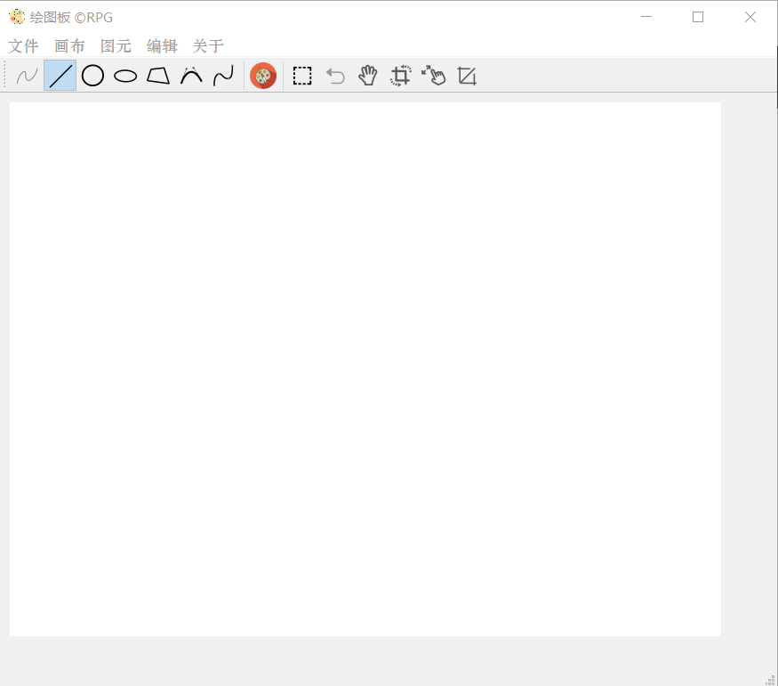

### 设计亮点

- [曲线绘制中的双曲线实时显示](#贝塞尔曲线绘制)：

  可以看到，贝塞尔曲线和B样条曲线在绘制过程中，实时显示的曲线不止一条，而是一条实线，一条虚线。期中，**实线是预测用户在当前位置点击左键之后生成的图像**，**虚线是预测用户在当前位置点击右键之后生成的图像**。

  当用户最终点击左键停止作图之后，这两条曲线会变为一条曲线，作为最终的显示，并不会干扰用户的作图结果。

  **采用两条曲线进行实时显示的好处是，可以让用户更直观的了解自己下一步操作可能造成的后果，既了解点击左键之后的图像，也了解点击右键之后的图像，可以给用户良好和准确的用户体验。**

- [鼠标操作多个图元的选择变换](#平移)：

  通过鼠标选择一个或多个图元，并且直接通过鼠标拖拽或者滚轮的方式进行平移缩放等变换。

### 菜单栏介绍

菜单栏的整体展示如下：


#### 文件

- 打开 *(Ctrl O)*：可以选择打开 指令`.txt`文件 或者 图像`.bmp`文件(**目前尚未实现**)，如果打开的是指令文件，则会自动执行，并将最终结果显示在画板上。

  **关于指令文件的详述请见**[指令文件格式](#支持的指令格式)**。**

- 保存 *(Ctrl S)*：将当前画板上的图像保存到**bmp文件**。

#### 画布

- 刷新画布 *(Ctrl R)*：可以刷新画布*（如果遇到显示不正常，可以尝试使用此功能）*。
- 清空画布：清空所有已经绘制的图形，返还空白画布。
- 画布大小：可以弹出对话框，设置当前的画布大小*（不丢失图元信息）*。

#### 图元

- 平移 *(Ctrl P, Ctrl T)*：将会弹出对话框，通过数据的输入进行平移变换。
- 旋转 *(Ctrl P, Ctrl R)*：将会弹出对话框，通过数据的输入进行旋转变换。
- 缩放 *(Ctrl P, Ctrl S)*：将会弹出对话框，通过数据的输入进行缩放变换。
- 裁剪 *(Ctrl P, Ctrl C)*：将会弹出对话框，通过数据的输入进行裁剪变换。
- 选择：使用矩形选择框在画布上选择图元进行图元变换操作。

#### 编辑

**当前尚未实现任何这其中的功能，而作为一个空闲菜单。**


#### 关于

- 关于作者：点开之后可以查看关于作者的基本信息，还可以直接向作者发送邮件或者查看作者的GitHub主页。
- 关于软件：点开之后可以查看关于软件的基本设计信息，还可以进入软件的Release项目库或者打开存放再代码库中的使用手册。
- 历史版本：进入软件的Release页面，可以直接看到曾发布过的每个版本。
- 更新：跳转进入最新的发布页面，手动检查软件更新。


### 工具栏

工具栏的整体展示如下：**[为打开软件时的初始状态]**


从左至右*(包括当前无法点击的工具)*分别为：

#### 绘图模式

- 自然曲线：**无法点击，目前尚不支持这种绘图模式**。
- 直线：点击之后，选择直线绘制方式，可以直接在画板上绘制直线，使用Bresenham算法。
- 圆：点击之后，选择绘制圆形，可以直接在画板上绘制圆形。
- 椭圆：点击之后，选择椭圆绘制模式，可以直接在画板上绘制椭圆形。
- 多边形：点击之后，选择多边形绘制模式，可以直接在画板上绘制多边形。
- 贝塞尔曲线：点击之后，选择贝塞尔曲线绘制模式，可以直接在画板上绘制使用贝塞尔曲线算法生成的曲线。
- B样条曲线：点击之后，选择B样条曲线绘制模式，可以直接在画板上绘制使用三次均匀B样条曲线算法生成的曲线。

#### 画笔

- 调色板：点击之后，弹出调色板，选择颜色之后点击`OK`，可以更改画笔颜色为设定的颜色

#### 图元选择和变换模式

- 选择：功能同[菜单栏-图元-选择](#图元)，进入图元选择和变换模式，使用矩形框在画板上选择一块区域，以此来选择需要进行变换的图元。
- 退出：退出图元选择模式以及图元变换模式，返回绘图模式。
- 平移：直接拖动已经选择的图元进行平移操作。
- 旋转：直接拖动已经选择的图元进行旋转操作。
- 缩放：通过鼠标的滚轮对已经选择的图元进行缩放操作。
- 裁剪：通过选择一个矩形窗口对已经选择的图元进行裁剪操作。


### 其他

#### 状态栏


当鼠标在画板中移动的时候，在左下角的状态栏中将会实时显示**当前的鼠标位置**以及**画板的尺寸**，给用户作图等操作以准确的参考。

#### 画板

可以用鼠标在画板上点击和移动，作为画布的程序表示。


### 绘图

#### 确保软件处于绘图模式

如果希望使用鼠标在画板上直接绘制图形，需要确保当前的软件状态是处于绘图模式的。

确认方法很简单，因为软件只有两种模式，**绘图模式**和**图元选择及变换模式** *（对应的工具栏说明详见[绘图模式](#绘图模式)和[图元选择和变换模式](#图元选择和变换模式)）*。只需要确定自己当前的**选中特效**是出现在绘图模式区，就可以进行相应的绘图。


如上的红色区域，则是绘图模式的表示区域，如果在这个范围内有选中特效*（如上有直线的选中特效）*，则代表处于绘图模式。

#### 绘图模式鼠标功能简述

- 左键：单击开始绘图，再次单击结束绘图。
- 右键：单击增加控制点*（对于多边形/曲线）*。
- 移动：图元终止点的移动，画布将实时生成变化的图形。

#### 绘制直线

1. 在工具栏选择直线绘制模式。
2. 在画布上选择任意点单击左键开始绘制。
3. 移动鼠标到显示的图像符合自己的想法。
4. 再次单击左键结束绘制。

具体过程展示如下：

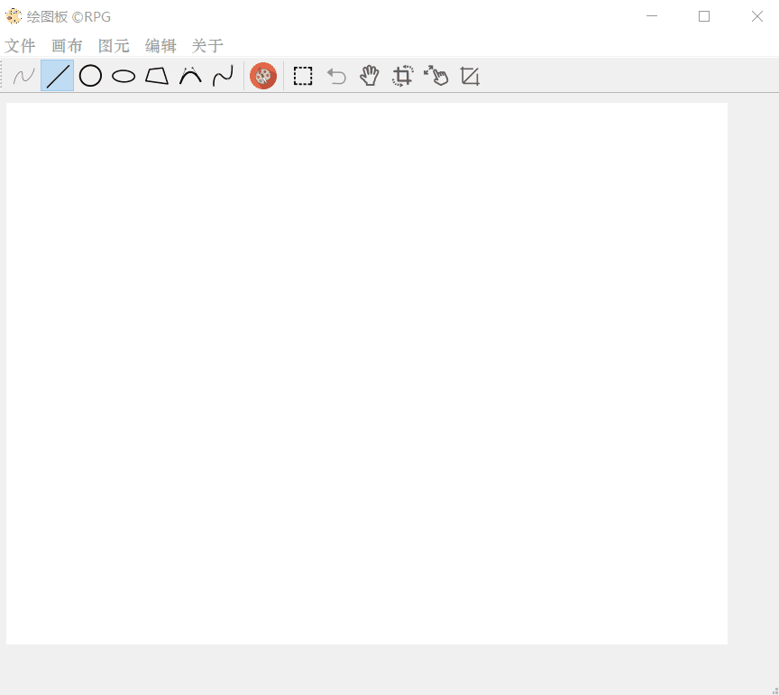

#### 绘制圆形

1. 在工具栏选择圆形绘制模式。
2. 在画布上选择任意点单击左键开始绘制。
3. 移动鼠标到显示的图像符合自己的想法。
4. 再次单击左键结束绘制。

更多的细节详见[绘制直线](#绘制直线)。

#### 绘制椭圆

1. 在工具栏选择椭圆绘制模式。
2. 在画布上选择任意点单击左键开始绘制。
3. 移动鼠标到显示的图像符合自己的想法。
4. 再次单击左键结束绘制。

更多的细节详见[绘制直线](#绘制直线)。

#### 绘制多边形

1. 在工具栏选择多边形绘制模式。
2. 在画布上选择任意点单击左键开始绘制。
3. 移动鼠标到显示的图像符合自己的想法。
4. 单击右键，在当前位置新增顶点。
5. 重复3/4步直到图像如最终预期。
6. 再次单击左键结束绘制。

具体过程展示如下：


#### 贝塞尔曲线绘制

1. 在工具栏选择贝塞尔曲线绘制模式*（注意：有两个曲线的图标，当鼠标悬浮在图标上的时候，会显示具体的算法）*。
2. 在画布上选择任意点单击左键开始绘制。
3. 移动鼠标到显示的图像符合自己的想法。
4. 单击右键，在当前位置新增控制顶点。
5. 重复3/4步直到图像如最终预期。
6. 再次单击左键结束绘制。

具体过程展示如下：

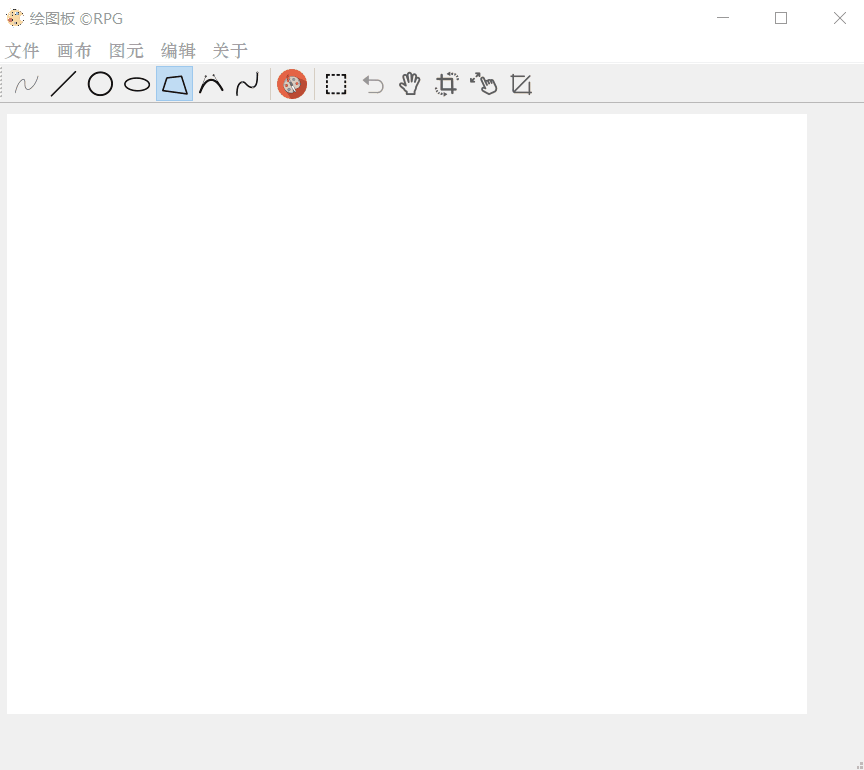

**这里要特别说明：**可以看到，贝塞尔曲线在绘制过程中，实时显示的曲线不止一条，而是一条实线，一条虚线。期中，**实线是预测用户在当前位置点击左键之后生成的图像**，**虚线是预测用户在当前位置点击右键之后生成的图像**。

当用户最终点击左键停止作图之后，这两条曲线会变为一条曲线，作为最终的显示，并不会干扰用户的作图结果。

**采用两条曲线进行实时显示的好处是，可以让用户更直观的了解自己下一步操作可能造成的后果，既了解点击左键之后的图像，也了解点击右键之后的图像，可以给用户良好和准确的用户体验。**这部分将会在B样条曲线中有更明显的体现。

*另外需要注意，由于n个控制点下的贝塞尔曲线有n-1次，所以随着控制点的增加，算法的复杂度是指数增长，所以当控制点大于等于5个的时候，会出现明显的卡顿和延迟，因此建议使用贝塞尔曲线时不要超过5个控制点。*

#### B样条曲线绘制

`这里，B样条曲线采用的是均匀三次B样条进行绘制。`

1. 在工具栏选择B样条曲线绘制模式*（注意：有两个曲线的图标，当鼠标悬浮在图标上的时候，会显示具体的算法）*。
2. 在画布上选择任意点单击左键开始绘制。
3. 移动鼠标到显示的图像符合自己的想法。
4. 单击右键，在当前位置新增控制顶点。
5. 重复3/4步直到图像如最终预期。
6. 再次单击左键结束绘制。

具体过程展示如下：

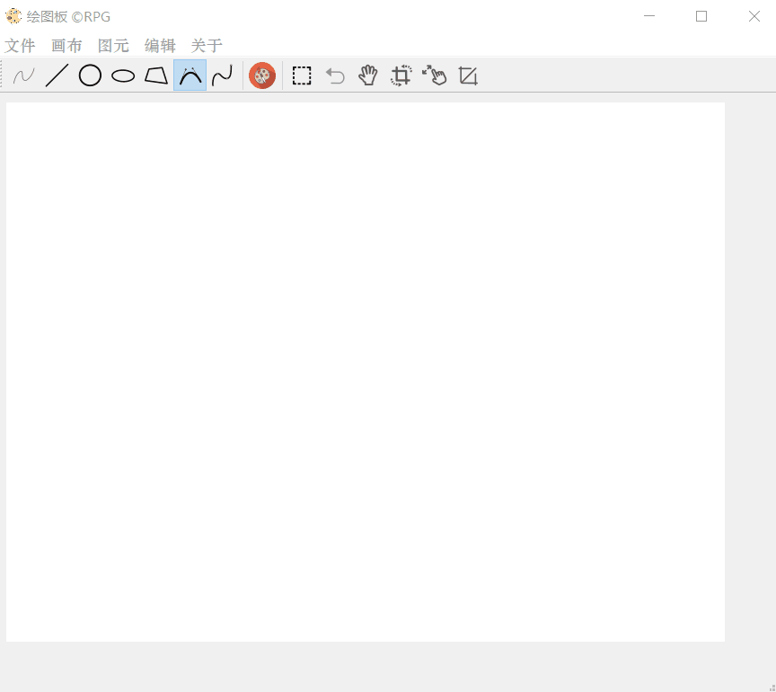


### 图元变换

#### 图元选择和变换模式的进入与退出

与[绘图模式](#确保软件处于绘图模式)是相对应的，如果希望使用鼠标进行图元的选择和变换，需要确保当前的软件状态是处于图元选择和变换模式的。

确认方法很简单，因为软件只有两种模式，**绘图模式**和**图元选择及变换模式** *（对应的工具栏说明详见[绘图模式](#绘图模式)和[图元选择和变换模式](#图元选择和变换模式)）*。只需要确定自己当前的**选中特效**是出现在图元选择和变换区，就可以进行相应的选择和变换。


如上的红色区域，就是图元选择和变换模式的表示区域，如果在这个范围内有选中特效*（如上有选择的选中特效）*，则代表处于图元选择和变换模式。

##### 进入选择和变换模式

进入选择和变换模式需要点击该区域的第一个选择框，如上图所示的情况，就是进入了图元选择和变换模式。


如上为进入图元选择和变换模式的动画显示。

##### 退出选择和变换模式

退出选择和变化模式需要点击该区域的第二个按键，也就是红色的返回按键，就可以退出图元选择和变换模式，回到绘制模式。


如上为退出图元选择和变换模式的动画显示。

#### 选择部分图元

进入了图元选择和变换模式之后，需要首先选择一部分的图元，才能够进行平移/旋转/缩放/裁剪等变换。

点击了**选择框**之后，在画布中的鼠标会变成一个十字选择样式，使用这个鼠标摁住左键，之后再拖动选择，最后松开左键，则**完全落在矩形选择框内的图元**则是被选中的图元。

被**选中的图元会变粗显示在画布中**。

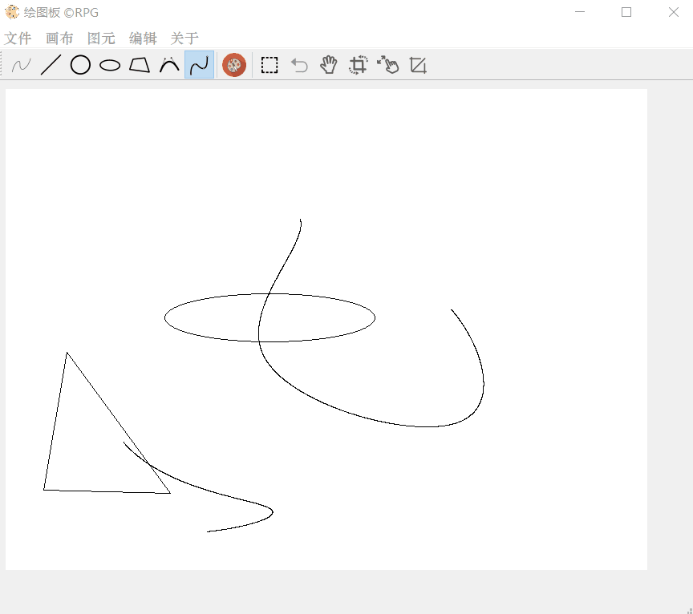

如上为选择了一个椭圆和一个曲线的选择过程。

#### 平移

进行平移变换的步骤为：

1. 选择部分图元。
2. 点击平移按钮。
3. 在画布上拖拽平移即可。

如下为一个平移示例：

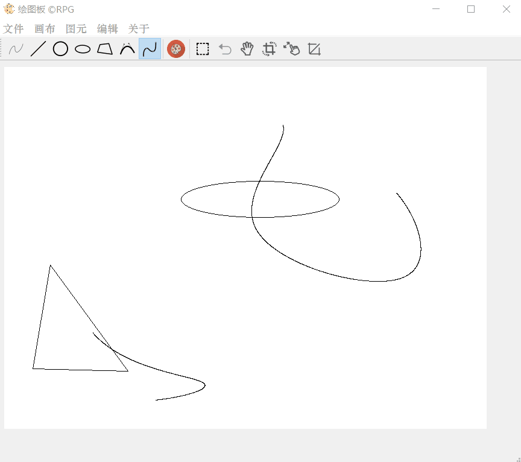

#### 旋转

进行旋转变换的步骤为：

1. 选择部分图元。
2. 点击旋转按钮。
3. 在画布上拖拽旋转即可。

如下为一个旋转示例：

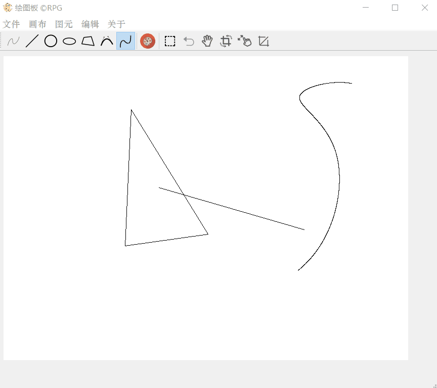

#### 缩放

进行缩放变换的步骤为：

1. 选择部分图元。
2. 点击缩放按钮。
3. 在画布上使用滚轮转动进行缩放。

**注意：由于使用的算法是有一定误差的，所以如果将图像缩小到非常小之后再放大回到正常大小将会有一定成都的失真，这是因为图元信息是INT类型进行存储的，所以累次造成了较大的误差，需要注意要尽量避免这种操作。**

如下为一个缩放示例：

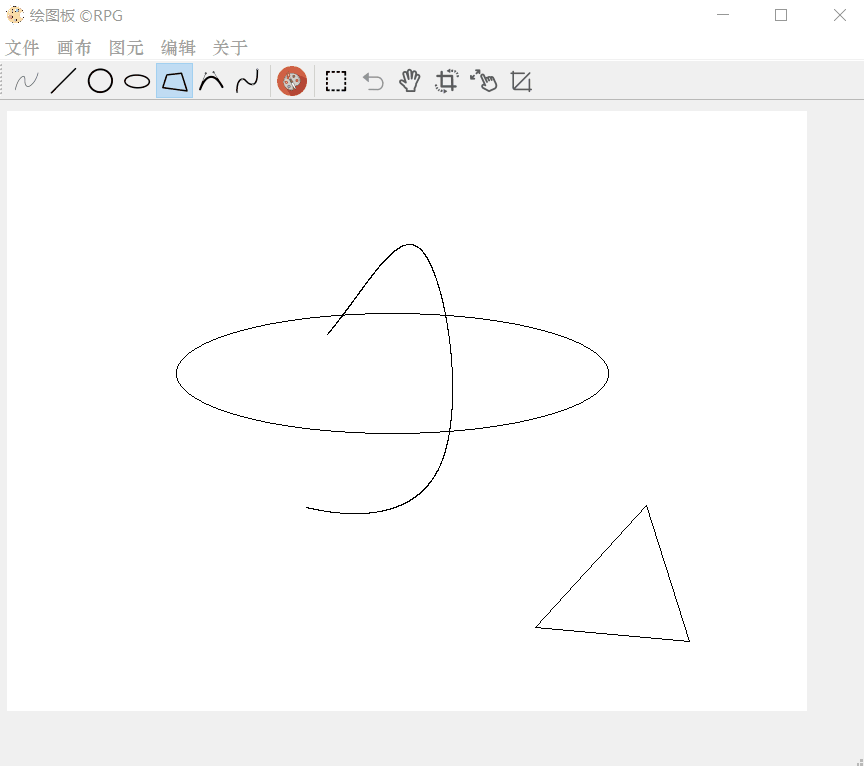

#### 裁剪

进行裁剪变换的步骤为：

1. 选择部分图元。
2. 点击裁剪按钮。
3. 在画布上拖拽形成一片选择域（拖拽方法和之前选择部分图元的方法一样，按住左键移动，直到选择完成松开左键），位于选择域内的线段将会被保留，其余的将会被裁剪。

如下为一个裁剪示例：

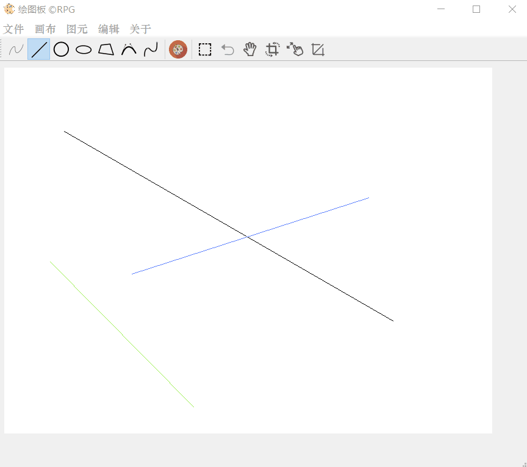

#### 多种变换的示例

有时候，由于用户的需求，需要复合变换，这里只需要组合上述操作即可，我们给出示例：

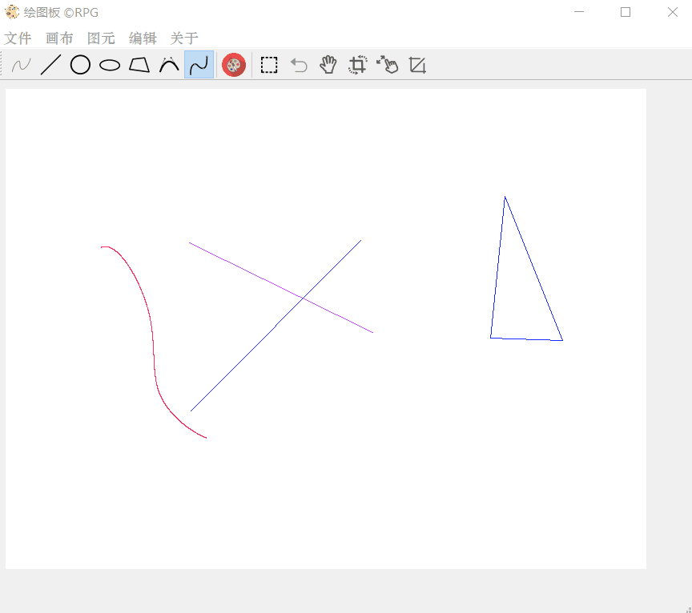

#### 使用对话框进行更精确的图元变换

使用鼠标进行图元变换，虽然非常的方便快捷，但是可能无法完成很精确的变换，或者规定旋转轴进行更多种类的旋转。

为了平衡这种情况下的需求，笔者提供了填入数据这种更加精确的图元变换方式，供使用者选择。

**需要输入图元编号，一般我们规定，按照用户作图的顺序，编号从0开始递增。**

具体的方法我们在这里不进行叙述，只给出一个例子进行表述：

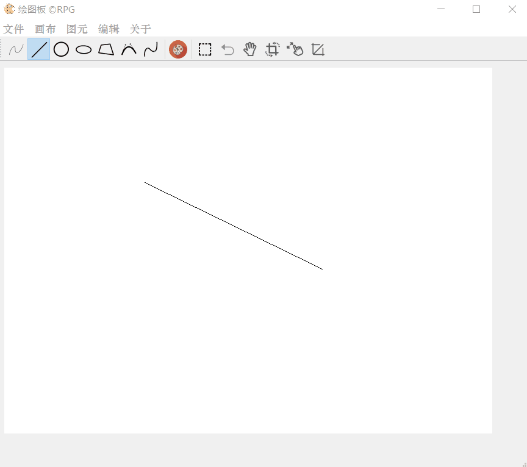


### 其他

#### 打开指令文件

我们在**文件**菜单中提供了打开指令文件的GUI接口，并且会在画布中显示结果，具体的操作如下示例所示：


#### 保存文件

同样在**文件**菜单中可以将绘制的图片导出到文件进行保存，下面给出一个示例：


#### 更改画笔颜色

直接给出示例：

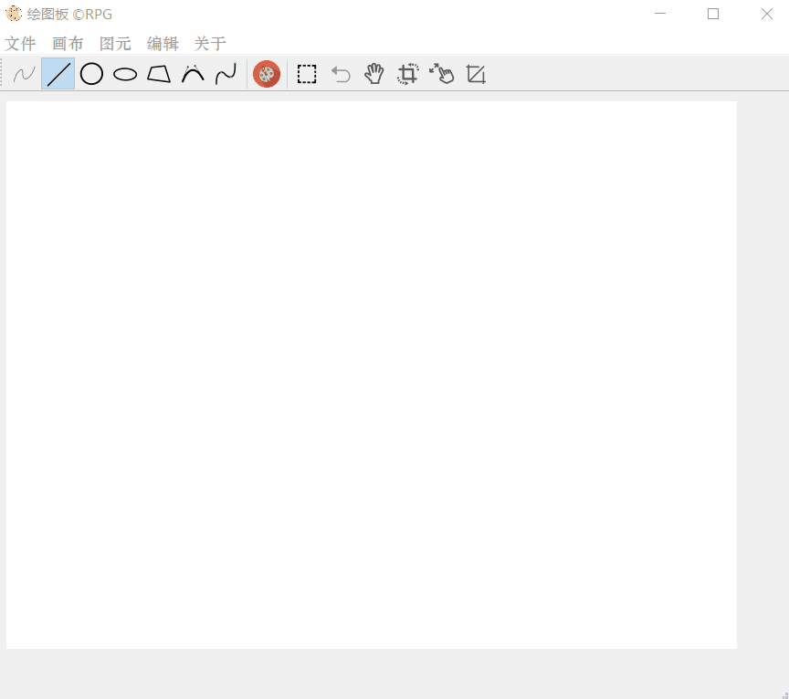

#### 杂项

还有一些其他的操作，在这里进行粗略的展示：

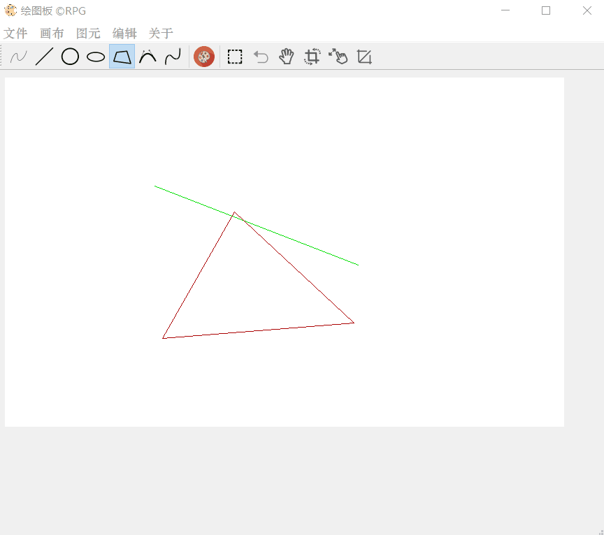

